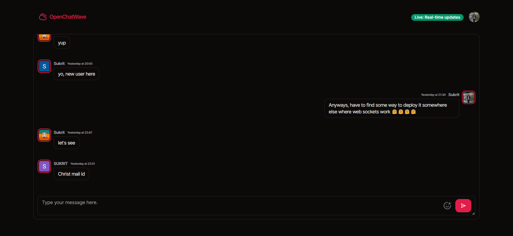

# [OpenChatWave](https://socket-drizzle-practice.vercel.app)
Showcase images, projects, certificates, experiences, and education seamlessly for a standout professional portfolio.

[](https://socket-drizzle-practice.vercel.app)

## Tech Stack

- **Framework:** [Next.js](https://nextjs.org)
- **Database:** [PlanetScale](https://planetscale.com/)
- **Styling:** [Tailwind CSS](https://tailwindcss.com)
- **Authentication:** [NextAuth.js](https://next-auth.js.org/)
- **ORM:** [Drizzle ORM](https://orm.drizzle.team/)
- **UI Components:** [shadcn/ui](https://ui.shadcn.com)
- **Typesafe APIs** [tRPC](https://trpc.io/)
- **Web Sockets** [socket.io](https://socket.io/)
- **Video Calls** [Livekit.io](https://livekit.io/)
- **Deployment:** [Vercel](https://vercel.com/dashboard)

## Key Features

- Authentication with **NextAuth.js**
- File uploads with **uploadthing**
- ORM using **Drizzle ORM**
- Database on **PlanetScale**
- End-to-end typesafe APIs with **tRPC**
- Validation with **Zod**
- Storing data with **PlanetScale**
- Responsive design with **Tailwind CSS**

## Running Locally

1. Clone the repository

```bash
git clone https://github.com/Sukrittt/socket-drizzle-practice.git
```

2. Install dependencies using pnpm

```bash
pnpm install
```

3. Copy the `.env.example` to `.env` and update the variables.

```bash
cp .env.example .env
```

4. Start the development server

```bash
pnpm dev
```

5. Push the database schema

```bash
pnpm db:push
```

## How do I deploy this?

Follow the deployment guides for [Vercel](https://create.t3.gg/en/deployment/vercel), [Netlify](https://create.t3.gg/en/deployment/netlify) and [Docker](https://create.t3.gg/en/deployment/docker) for more information.
